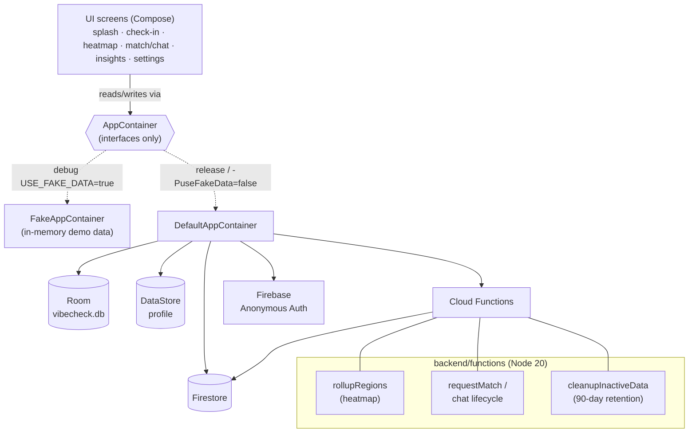
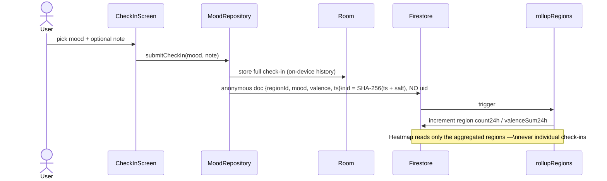

# VibeCheck 💜

**An AI-powered social mood tracker for the US & UK.** Log how you feel in one
tap a day, see how your city/country is feeling on an anonymous heatmap, get a
~2‑minute "micro‑action" for your mood, and — if you opt in — have a 5‑minute
anonymous chat with someone on your wavelength.

Privacy-first by design: **no email, no phone, no real name, no precise
location.** Built for the UK Online Safety Act + US COPPA.

> Status: **feature-complete on demo data.** Debug builds run on an in-memory
> fake data layer; the real Room + Firebase stack ships in release builds.
> Outstanding before a real launch: a real Firebase project, a Google Maps API
> key, and server-trusted purchase validation — see [Roadmap](#roadmap).

---

## Features

| Area | What it does |
|---|---|
| **Daily check-in** | 6 moods (😊 😐 😔 😡 😴 🥳) + optional ≤5-word note; streak + 7-day strip |
| **Micro-actions** | Rule-based ~2-min activity suggested for your mood, with a countdown timer |
| **Heatmap** | Aggregated, anonymous city-level mood — Local / 🇺🇸 US / 🇬🇧 UK / Global, list + map |
| **Anonymous match + chat** | Opt-in, mood-matched, 5-min ephemeral chat; profanity filter + report; auto-deleted |
| **Insights** | Weekly trend + best/toughest day; CSV export (premium) |
| **VibeCheck Plus** | $2.99 / £2.49 monthly subscription via Google Play Billing 7 |

UK/US localisation throughout (e.g. "Knackered"/"Buzzing", dual currency, both
crisis helplines — 988 and 116 123).

## Tech stack

- **Kotlin 2.1**, **Jetpack Compose** (Material 3), min SDK 26 / target 35
- **Room** + **DataStore** (local) · **Firebase** Anonymous Auth + Firestore + Functions (remote)
- **Google Maps** Compose · **Play Billing 7** · **WorkManager** (daily reminder)
- **Cloud Functions** (Node 20) for heatmap rollups, matchmaking, and retention
- No DI framework — a hand-rolled `AppContainer` is the composition root

## Quick start

```bash
git clone https://github.com/dipen-b/vibe-check-apk.git
cd vibe-check-apk

# 1. Point the SDK + (placeholder) Maps key — see local.properties
#    sdk.dir=/path/to/Android/sdk
#    MAPS_API_KEY=YOUR_KEY   (a placeholder works; map tiles stay blank)

# 2. Build & install the debug app (runs on demo data — no Firebase needed)
./gradlew :app:installDebug

# 3. Run the test suites
./gradlew :app:testDebugUnitTest        # Kotlin unit tests
cd backend/functions && npm install && npm test   # Cloud Function logic tests
```

Debug builds default to the **in-memory demo data layer** (`USE_FAKE_DATA=true`),
so you can run the whole app with **no backend**. To exercise the real stack,
build release or pass `-PuseFakeData=false` and run the Firebase emulator
(see [docs/SETUP.md](docs/SETUP.md)).

## Architecture at a glance

Every screen depends only on **interfaces** (`data/Repositories.kt`), handed to
it by an `AppContainer`. Debug swaps in fakes; release wires the real stack.
That single seam is why the whole app runs with no backend.



**Check-in data flow (privacy-preserving):**



## Project structure

```
app/src/main/java/com/vibecheck/app/
  core/            AppConfig, Cities (region buckets), models, reminder
  data/
    Repositories.kt      interfaces every screen depends on
    AppContainer.kt      composition root interface
    DefaultAppContainer  real wiring (Room + Firebase)
    fake/                in-memory demo layer (default in debug)
    local/               Room DB + DataStore
    real/                Firebase-backed repositories
    firebase/            FirebaseProvider (emulator-aware)
  domain/chat/     ProfanityFilter
  ui/              splash, onboarding, checkin, actions, heatmap,
                   chat (match+chat), insights, settings, subscription,
                   home (nav scaffold), navigation, theme, components
backend/functions/  Cloud Functions (rollup, matchmaking, retention) + tests
firestore.rules     deny-by-default security rules
CONTRACTS.md        architecture contract — READ THIS before coding
```

## Cloud Functions

| Function | Trigger | Purpose |
|---|---|---|
| `onCheckinCreated` | checkin create | live region count/valence increment |
| `rollupRegions` | hourly | authoritative 24h heatmap recompute |
| `cleanupInactiveData` | daily | 90-day retention (users + old check-ins) |
| `requestMatch` / `cancelMatch` | callable | mood-matched matchmaking |
| `leaveSession` / `reportPeer` | callable | end / report a chat (participant-only) |
| `closeExpiredSessions` | every 2 min | close expired chats + purge messages |

## Privacy invariants (do not break)

- No PII anywhere — no email, phone, or real name.
- No precise coordinates; only coarse `regionId` buckets leave the device.
- Mood check-ins are anonymous **even to admins**: the Firestore doc id is a
  `SHA-256(timestamp + random salt)` and carries no uid.
- No device identifiers / no IP logging. Notes are capped at 5 words.
- All data deleted after 90 days of inactivity.

## Roadmap

- [ ] Real Firebase project (currently the `demo-vibecheck` emulator placeholder)
- [ ] Real Google Maps API key (map tiles are blank with the placeholder)
- [ ] Server-trusted entitlement via the `validatePurchase` callable
- [ ] Broader test coverage + end-to-end emulator verification

## Contributing

New here? Start with **[CONTRIBUTING.md](CONTRIBUTING.md)** for the workflow and
**[CONTRACTS.md](CONTRACTS.md)** for the architecture rules. Detailed backend /
Firebase / Maps setup lives in **[docs/SETUP.md](docs/SETUP.md)**.
