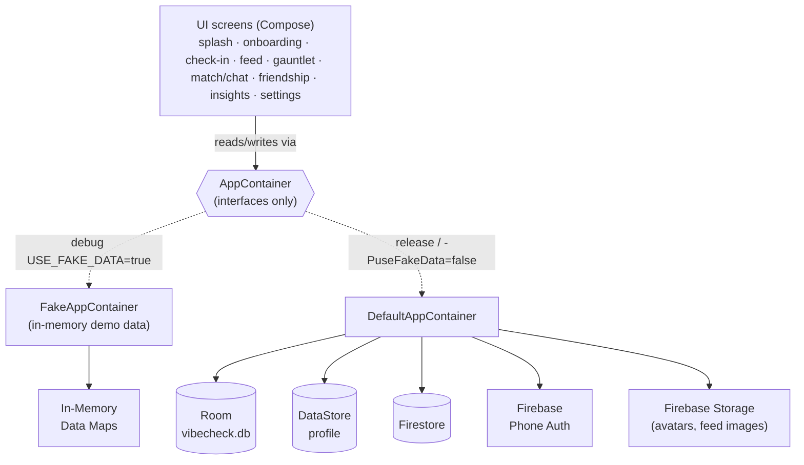
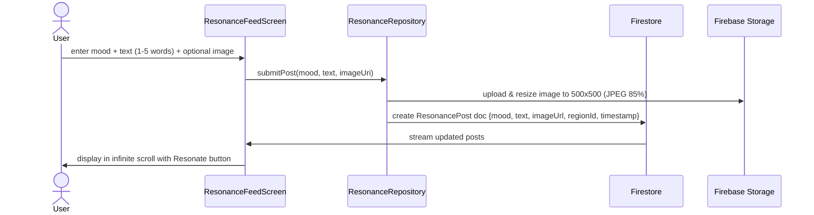

# VibeCheck 💜

**An AI-powered social mood tracker for the US & UK.** Log how you feel in one tap a day, connect with friends via phone-verified accounts, share anonymous mood vibes on The Resonance Feed, complete daily mood quests in The Gauntlet arcade, and get a ~2‑minute "micro‑action" for your mood.

Privacy-first by design: **Phone-based authentication, friend search, and optional profile creation.** Built with Jetpack Compose, Firebase, and Firestore.

> Status: **Phase 2 Feature-Complete.** 
> - ✅ Phase 1: Resonance Feed (TikTok-style mood snippets, 1-5 words, image upload)
> - ✅ Phase 2: Gauntlet Quests (3 daily interactive quests, streaks, leaderboard)
> - ✅ Friendship Module (OTP verification, phone-based friend search, bidirectional requests)
> - ✅ Enhanced Onboarding (6-step flow with phone verification integrated)

---

## Features

| Area | What it does |
|---|---|
| **Daily check-in** | 6 moods (😊 😐 😔 😡 😴 🥳) + optional ≤5-word note; streak + 7-day strip |
| **The Resonance Feed** | Anonymous vertical infinite-scroll mood snippets (1-5 words), 🔥 Resonate voting, gallery image upload with auto-resize |
| **The Gauntlet** | 3 daily interactive quests (Gratitude Typing, Tap Game, Voice Record, Reflection, Movement, Breathing), 🔥 streak tracking, 💎 Vibe Gems currency, global leaderboard |
| **Friendship Module** | Phone-verified accounts, friend search by name/phone, bidirectional friend requests, protected phone numbers, friend list with avatars |
| **Micro-actions** | Rule-based ~2-min activity suggested for your mood, with a countdown timer |
| **Insights** | Weekly trend + best/toughest day; CSV export (premium) |
| **VibeCheck Plus** | $29.00 / £29.00 monthly subscription via Google Play Billing 7 |

**Authentication & Privacy:**
- OTP-based phone verification integrated into onboarding
- User profiles auto-created with First Name, Last Name, Avatar
- Friend phone numbers protected (search enabled, display disabled)
- 100-character limit on posts with prominent word count
- Location auto-detection on feed entry (region-based, no PII)

## Tech stack

- **Kotlin 2.1**, **Jetpack Compose** (Material 3), min SDK 26 / target 35
- **Room** + **DataStore** (local) · **Firebase** (Phone Auth, Firestore) + **Firebase Storage** (images)
- **Coil** for async image loading · **Google Play Billing 7** · **WorkManager** (daily reminder)
- No DI framework — a hand-rolled `AppContainer` is the composition root
- Repository pattern with interface + Real (Firebase) / Fake (in-memory) implementations

## Quick start

```bash
git clone https://github.com/dipen-b/vibe-check-apk.git
cd vibe-check-apk

# 1. Build & install the debug app (runs on demo data — no Firebase needed)
./gradlew :app:installDebug

# 2. Run the test suites (coming soon)
./gradlew :app:testDebugUnitTest        # Kotlin unit tests
```

Debug builds default to the **in-memory demo data layer** (`USE_FAKE_DATA=true`), so you can run the whole app with **no backend**. To exercise the real stack with Firebase, update `DefaultAppContainer.kt` to point to your Firebase project.

## Architecture at a glance

Every screen depends only on **interfaces** (`data/Repositories.kt`), handed to it by an `AppContainer`. Debug swaps in fakes; release wires the real stack. That single seam is why the whole app runs with no backend.



**Data flow (sample: Resonance Feed post):**



## Project structure

```
app/src/main/java/com/vibecheck/app/
  core/
    model/           Mood, User, Quest, ResonancePost, FriendRequest
    AppConfig, Cities, reminder
  data/
    Repositories.kt          interfaces (Mood, Heatmap, Chat, Quest, Resonance, Friendship, Billing)
    AppContainer.kt          composition root interface
    DefaultAppContainer      real wiring (Room + Firebase + FirebaseStorage)
    FakeAppContainer         in-memory demo layer (default in debug)
    fake/                    FakeMoodRepository, FakeChatRepository, FakeQuestRepository, etc.
    real/                    Real*.kt (Firebase-backed implementations)
    firebase/                FirebaseProvider (emulator-aware)
    local/                   Room DB + DataStore
  domain/chat/       ProfanityFilter
  ui/
    splash/          SplashScreen
    onboarding/      OnboardingScreen (6 steps: Welcome → Phone → OTP → Profile → Age → Finish)
    checkin/         CheckInScreen
    feed/            ResonanceFeedScreen (infinite scroll mood feed with images)
    gauntlet/        GauntletScreen (3 quests, leaderboard, streaks)
    friendship/      FriendshipScreen, FriendsListScreen (phone auth, search, requests)
    chat/            MatchScreen, ChatScreen
    insights/        InsightsScreen
    settings/        SettingsScreen
    home/            HomeScaffold (navigation: Check-in, Feed, Friends, Gauntlet, Settings)
    theme/           Color, Typography, Theme
    components/      Reusable composables
backend/functions/   (planned) Cloud Functions for aggregation, matchmaking, cleanup
firestore.rules      (placeholder) Security rules
CONTRACTS.md         architecture contract
```

## Data models

**User** (Friendship Module):
```kotlin
data class User(
    val userId: String,
    val firstName: String,
    val lastName: String,
    val phoneNumber: String,      // protected, not displayed
    val countryCode: String,
    val avatarUrl: String,
    val createdAtMillis: Long
)
```

**ResonancePost** (Feed):
```kotlin
data class ResonancePost(
    val id: String,
    val mood: Mood,
    val text: String,             // 1-5 words, ≤100 chars
    val regionId: String,
    val createdAtMillis: Long,
    val resonateCount: Int,
    val authorId: String,
    val imageUrl: String?         // optional gallery image, 500x500
)
```

**Quest** (Gauntlet):
```kotlin
data class Quest(
    val id: String,
    val questNumber: Int,         // 1-3
    val mood: Mood,
    val title: String,
    val description: String,
    val questType: QuestType,     // GRATITUDE_TYPING, TAP_GAME, etc.
    val isCompleted: Boolean
)
```

## Onboarding Flow (6 Steps)

1. **Welcome** — Intro screen
2. **Phone Input** — Enter phone number, send OTP
3. **OTP Verification** — Enter 6-digit code from SMS
4. **Profile Creation** — First Name, Last Name (auto-creates user profile)
5. **Age Verification** — Age bracket selection
6. **Finish** — Optional username, reminder opt-in

After completion, user is logged in and can access all tabs.

## Roadmap

The full path to a Play Store release is tracked in **[docs/LAUNCH.md](docs/LAUNCH.md)**.

Current priorities:
- [ ] Real Firebase project configuration
- [ ] Image optimization & caching for Feed
- [ ] Quest mini-games implementation (Tap, Voice, etc.)
- [ ] Leaderboard backend aggregation
- [ ] End-to-end test coverage
- [ ] Play Console listing + subscription product
- [ ] Privacy Policy, Terms of Service
- [ ] Signed AAB for Play Store

## Contributing

New here? Start with **[CONTRIBUTING.md](CONTRIBUTING.md)** for the workflow and **[CONTRACTS.md](CONTRACTS.md)** for the architecture rules.

---

**Built with ❤️ by the VibeCheck team**
